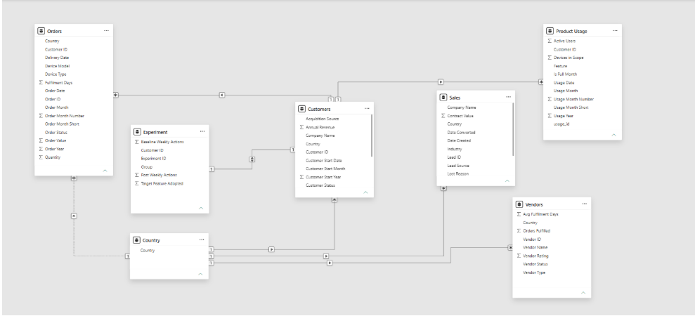

<table width="100%">
<tr>
<td><h1>Vectral</h1></td>
<td align="right">

</td>
</tr>
</table>

## What Vectral Should Measure

15 metrics, why each one matters, what it helps decide, and who should own it. A few available fields didn't make this list on purpose `device_model` and the raw `active_users ÷ devices_in_scope` ratio both turned out to be unreliable during cleaning, so I left them out rather than build a metric on shaky ground.

| Metric                                          | Why it matters                                                                     | What it helps decide                                       | Owner                     |
| ----------------------------------------------- | ---------------------------------------------------------------------------------- | ---------------------------------------------------------- | ------------------------- |
| Active customers & net change                   | Tells you if the business is growing or shrinking, month by month                  | Whether to invest in acquisition, retention, or both       | RevOps / Customer Success |
| Total ARR                                       | The core revenue number leadership reports on                                      | Budget planning, board reporting                           | Finance / Leadership      |
| ARR by acquisition source                       | Shows which channels bring in the most valuable customers, not just the most leads | Where to spend marketing/BD budget                         | Marketing / Growth        |
| Churn rate                                      | An early warning, retention is usually cheaper than acquisition                    | Whether to invest more in onboarding or account management | Customer Success          |
| Win rate (of decided leads)                     | Shows how well the sales process converts real interest into revenue               | Sales process changes, quota setting                       | Sales                     |
| Pipeline value & volume by stage                | Shows how much revenue is in motion and where deals stall                          | Forecasting, and where to unblock the funnel               | Sales leadership          |
| Avg fulfilment days                             | A direct read on the customer's hardware experience                                | SLA setting, vendor selection                              | Operations                |
| Fail/cancel rate, by country                    | Flags where delivery is breaking down before it becomes a churn driver             | Where to fix logistics or change vendors                   | Operations                |
| Order volume & value by month                   | Basic demand signal for device ordering                                            | Inventory and vendor capacity planning                     | Operations / Finance      |
| Vendor performance (rating, fulfilment days)    | Flags underperforming vendors before they cause customer-facing problems           | Vendor contract renewal or replacement                     | Procurement               |
| ARR by plan tier                                | Shows how revenue is spread across Starter/Growth/Enterprise                       | Pricing and packaging strategy                             | Product / Finance         |
| Active users by feature, over time              | Shows what's actually getting used                                                 | Roadmap priorities what to invest in, what to retire       | Product                   |
| Devices managed per active customer             | A simple proxy for account size and room to grow                                   | Targeting upsell/expansion                                 | Sales / Customer Success  |
| Experiment lift: weekly actions & adoption rate | Tests whether a specific product change actually changes behaviour                 | Go/no-go on a full feature rollout                         | Product                   |
| Revenue concentration by country                | Shows how dependent the business is on a few markets                               | Where to invest in local support or sales                  | Leadership / Sales        |

### Metrics I can't calculate reliably yet

These would be genuinely useful, but the data doesn't support them right now better to say so than fake it.

- **Customer acquisition cost (CAC) by channel.** Sales has no spend/cost field, and leads can't be traced to the customer they become neither the cost side nor the link exists.
- **Revenue growth per account, over time.** Customer revenue is a single snapshot, not a time series, so I can't see how one account's revenue changed month to month.
- **A real "adoption rate" from active_users ÷ devices_in_scope.** This ratio comes out above 100% in a third of all rows active_users isn't reliably capped by devices_in_scope, so I don't trust it as a literal percentage without checking with whoever owns that data.
- **Vendor cost or delivery performance per specific order.** Orders has no vendor_id column, so no order can be tied to the vendor that fulfilled it. Vendor numbers can only be viewed in aggregate.

---

## How I Connected the Data

Customers sits in the middle. Orders, Product Usage, and Experiment all connect to it through Customer ID — these are real, working relationships. Sales and Vendors don't connect to anything else in the model, on purpose, because the data as given genuinely doesn't support it.

**What connects, and how:**

- Customers to Orders (one customer, many orders). Clean relationship, every Customer ID in Orders exists in Customers.
- Customers to Product Usage (one customer, many usage rows). Clean after removing the 83 orphaned CUST-9999 rows.
- Customers to Experiment (one customer, one row). This is the one relationship set to filter both directions, and it's safe to do that here specifically because Experiment has no Country column so there's only one possible path between the two tables, nothing to get confused about.

**The Country bridge table.** Customers, Orders, Sales, and Vendors all have their own Country column, but Sales and Vendors don't connect to anything else so on their own, they couldn't share a single Country filter with the rest of the dashboard. I built one Country table by combining and de-duplicating the country values from all four tables, then connected all four to it. This doesn't create a real link between, say, Sales and Customers — it just lets one Country filter control every visual at once, since all four tables can "read" the same shared list.

**A finding that came out of building this.** Orders also has its own Country field, separate from the customer's registered country. I checked whether these ever disagree: 25 of 744 orders (3.4%) show a different country than the customer they belong to. Every single one of those 25 mismatches points to "United States" on the order side, no matter what the customer's real country is which looks like a data artifact, not real cross-border shipping (a genuine pattern would point to different countries, not the same one every time). Because of this, the model correctly leaves the direct Orders-to-Country link inactive, and the dashboard filters Orders by the customer's country instead.

**What doesn't connect, and why:**

- **Sales (leads) to Customers.** Leads are named "Prospect 0001"-style, customers are named "Customer 001"-style — zero overlap, and there's no shared ID field anywhere. A won lead can't be traced to the customer record it becomes. Fix: add a `converted_customer_id` field to Sales, filled in whenever a lead's outcome is set to Won.
- **Vendors to Orders.** Orders has no `vendor_id` column at all, so no order can be attributed to a specific vendor. Vendor numbers (rating, fulfilment days) can only be read at the vendor level, never cross-cut by customer, country, or order. Fix: add `vendor_id` to Orders.

I could have tried to fuzzy-match leads to customers by country and industry, or spread vendor performance evenly across orders in the same country. I decided against both, that would be guessing dressed up as data, and it's more likely to mislead a decision-maker than an honest "we can't answer this yet."

---

## The Product Experiment, in Full

### What I measured

Two things, both already sitting in the data: the change in average weekly actions from before to after the experiment, and the target-feature adoption rate. Weekly actions shows overall engagement; adoption rate shows whether people actually took up the specific new feature. Together they answer both "did behaviour change" and "did people use the thing we built."

### Treatment vs. Control

|                                     | Control (n=40) | Treatment (n=40) |
| ----------------------------------- | -------------- | ---------------- |
| Avg. baseline weekly actions        | 3.5            | 3.6              |
| Avg. post-experiment weekly actions | 3.4            | 5.7              |
| Change                              | -2.8%          | +57%             |
| Target-feature adoption rate        | 25%            | 53%              |

### What the data suggests

- Both groups started from almost the same baseline (3.5 vs 3.6 weekly actions), a good sign the split was reasonably random going in.
- Control's usage stayed flat; Treatment's rose by more than half. That gap is the real signal, not the raw numbers on their own.
- Adoption was roughly double in Treatment. Directionally, this looks like a genuine win for the feature.
- It isn't proof at the level of a properly run A/B test — no significance test was run, and the sample is only 80 customers total.

### A confound worth flagging, not hiding

I checked whether Treatment and Control were balanced by plan tier. They aren't:

| Plan       | Control | Treatment |
| ---------- | ------- | --------- |
| Starter    | 19      | 7         |
| Growth     | 15      | 17        |
| Enterprise | 6       | 16        |

Control skews Starter-heavy, Treatment skews Enterprise-heavy. If Enterprise customers naturally increase usage over time regardless of any new feature (more seats being rolled out internally, more momentum generally), some of Treatment's lift could be about who ended up in that group, not the feature itself. The lift does show up within every plan tier on its own (Enterprise, Growth, and Starter customers in Treatment all improved more than their Control counterparts), reassuring, but the group sizes within each tier are small (as few as 6-7 customers), so this check is suggestive, not conclusive.

### What I'd want before making a final call

- A real significance test (a t-test on the per-customer change, a chi-square test on adoption), not just comparing averages.
- Confirmation of how customers were actually assigned to each group, and a re-run that controls for plan tier.
- A longer observation window - I don't know if week-seven usage looks the same as week-one usage, or if this is a novelty effect that fades.
- Downstream business metrics tied to the feature (retention, expansion revenue, support tickets) more usage is only good if it doesn't cost something else.
